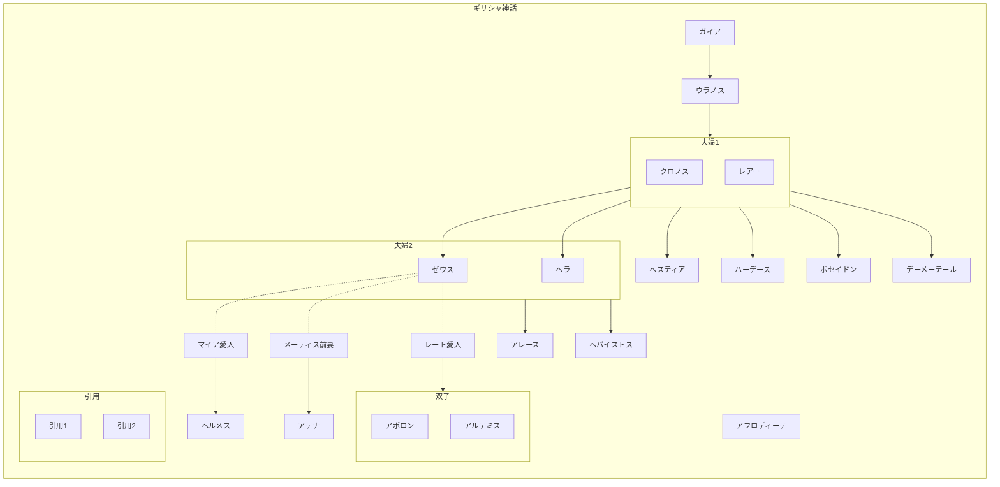

```mermaid
flowchart LR
subgraph ギリシャ神話
    subgraph 夫婦1
        direction BT
        クロノス & レアー
    end
    subgraph 夫婦2
        direction BT
        ゼウス & ヘラ
    end
    subgraph 双子
        direction BT
        アポロン & アルテミス
    end

    ガイア --> ウラノス --> 夫婦1

    夫婦1 --> ヘスティア
    夫婦1 --> ハーデース
    夫婦1 --> ヘラ
    夫婦1 --> ポセイドン
    夫婦1 --> デーメーテール
    夫婦1 --> ゼウス
    

    夫婦2 --> アレース & ヘパイストス
    ゼウス -.- レート愛人 --> 双子
    ゼウス -.- マイア愛人 --> ヘルメス
    ゼウス -.- メーティス前妻 --> アテナ

    アフロディーテ 
    subgraph 引用
        direction BT
        引用1 & 引用2
    end  
    click 引用2 href "https://ameblo.jp/montagna225/image-11908299183-13007934932.html"
    click 引用1 href "https://www.google.com/url?sa=i&url=https%3A%2F%2Fwww.ibma.jp%2Fnews%2F%25E7%25A5%259E%25E6%25A7%2598%25E3%2583%2591%25E3%2583%25A9%25E3%2583%2580%25E3%2582%25A4%25E3%2582%25B9%25EF%25BC%2581%25E3%2580%258E%25E3%2582%25AA%25E3%2583%25AA%25E3%2583%25A5%25E3%2583%25B3%25E3%2583%259D%25E3%2582%25B9%25E5%258D%2581%25E4%25BA%258C%25E7%25A5%259E%25E3%2580%258F%25E3%2582%2592%25E3%2582%2586%25E3%2582%258B%2F&psig=AOvVaw0ltjAAKbLlMOcHYblcUgKX&ust=1645666176995000&source=images&cd=vfe&ved=2ahUKEwj43bqw1pT2AhURJqYKHY9vBToQjRx6BAgAEAk"
end
```
