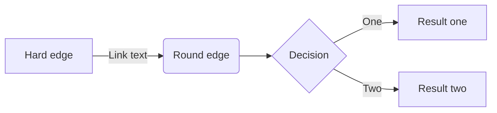
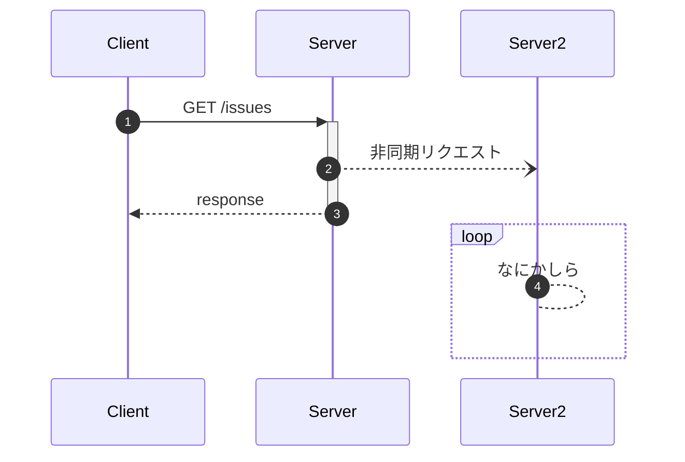

```mermaid
flowchart LR
    A[Hard edge] -->|Link text| B(Round edge)
    B --> C{Decision}
    C -->|One| D[Result one]
    C -->|Two| E[Result two]

```


```mermaid
sequenceDiagram
  autonumber
  Client->>+Server: GET /issues
  Server--)Server2: 非同期リクエスト
  Server-->>-Client: response
  loop
    Server2-->Server2: なにかしら
  end   

```

```mermaid
sequenceDiagram
  autonumber
  設計担当者->>+内部レビュー者: GET /issues
  内部レビュー者--)マージ担当者: 非同期リクエスト
  マージ担当者->>+お客様: マージ
  内部レビュー者-->>-お客様: response
  ```
